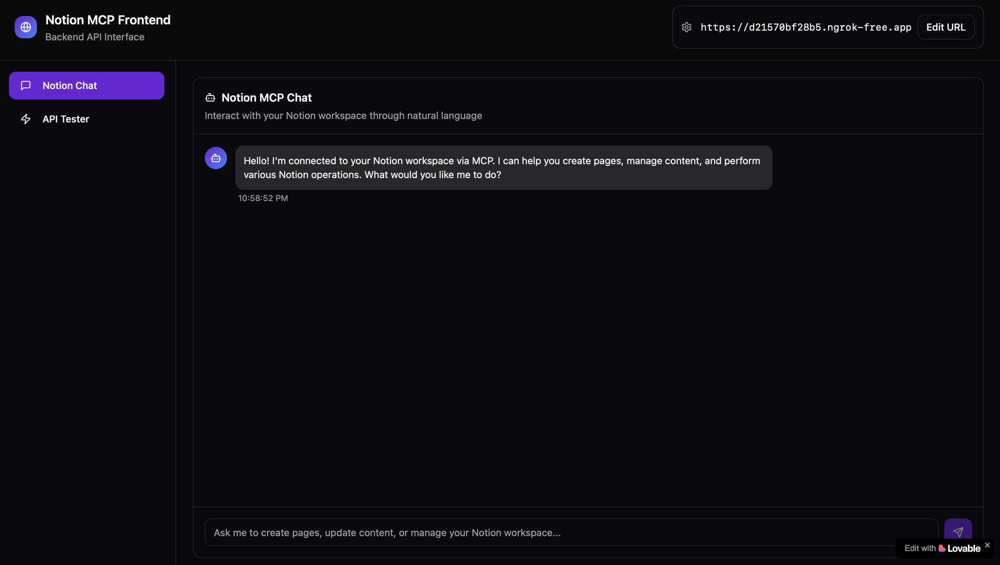
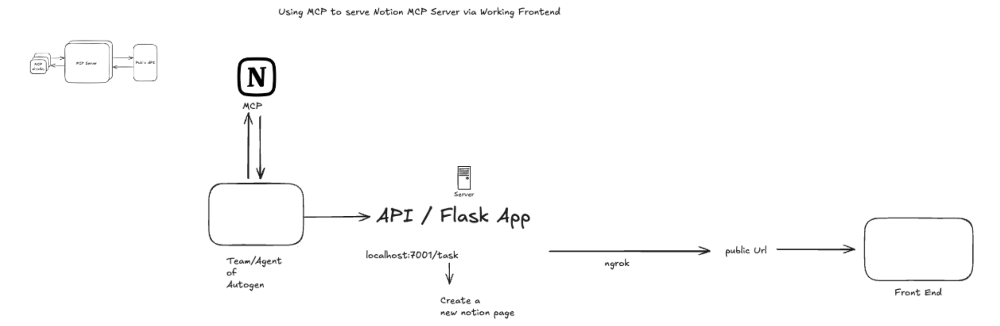
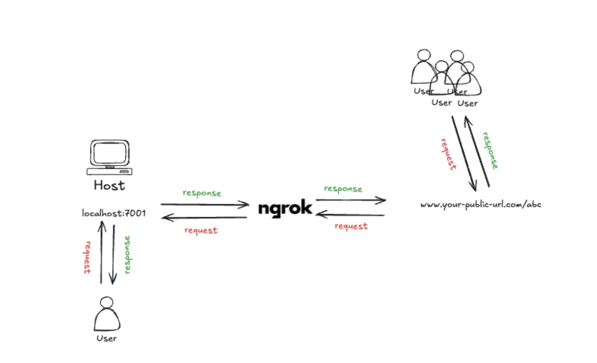

# MCP-Notion Interface

A production-ready agentic AI system that integrates Notion workspace management with Microsoft AutoGen multi-agent framework through Model Context Protocol (MCP).

## Live Application

**Frontend**: https://mcp-notion-chatbot.lovable.app  
**Backend**: Dynamically tunneled via ngrok (see deployment section)



## Architecture Overview

This project demonstrates advanced implementation of:
- **Model Context Protocol (MCP)** for standardized tool integration
- **Microsoft AutoGen** multi-agent conversational AI
- **Asynchronous Python** architecture with proper concurrency handling
- **Production deployment** with ngrok tunneling

### System Components

```
Frontend (Lovable) → ngrok Tunnel → Flask API → AutoGen Agent → MCP Tools → Notion API
```





## Technical Implementation

### MCP Integration
- **MCP Server**: `https://mcp.notion.com/mcp` via `mcp-remote`
- **Protocol**: Stdio-based MCP server communication
- **Tools**: Dynamic tool discovery and registration from Notion MCP server
- **Authentication**: Secure token-based Notion workspace access

### Agent Architecture
- **Framework**: Microsoft AutoGen with AssistantAgent implementation
- **Team**: RoundRobinGroupChat with 5-turn conversation limit
- **Model**: OpenAI GPT-4o via `autogen-ext` OpenAI client
- **Termination**: Text-based termination condition ("TERMINATE")
- **Reflection**: Tool use reflection enabled for improved decision making

### Async Architecture
```python
# Proper async chain implementation
Flask (sync) → asyncio.run() → AutoGen Team → MCP Tools → Notion API
```

## Project Structure

```
├── main.py                     # Flask API server with ngrok tunneling
├── .env.example                # Environment variables template
├── pyproject.toml              # UV dependency management
├── uv.lock                     # Dependency lock file
├── agents/
│   └── notion_agent.py         # AutoGen AssistantAgent configuration
├── teams/
│   └── notion_team.py          # RoundRobinGroupChat team setup
├── MCP/
│   └── notion_mcp_tools.py     # MCP server connection and tool registration
├── models/
│   └── openai_model_client.py  # OpenAI client configuration
├── config/
│   ├── settings.py             # Environment configuration
│   └── prompt/
│       └── system_prompt.py    # Agent system message
└── images/
    ├── frontend_ui.png         # Frontend interface screenshot
    ├── workflow.png            # System workflow diagram
    └── detailed_workflow_tunnelling.png  # Detailed architecture diagram
```

## API Endpoints

### POST /run
Execute tasks through the Notion agent
```json
{
  "task": "create a page named 'Project Timeline'"
}
```

**Response**:
```json
{
  "status": "success",
  "result": "Agent conversation stream output"
}
```

### GET /health
Health check endpoint

## Setup and Deployment


### Installation
```bash
# Clone repository
git clone <repository-url>
cd MCP-Notion-Project

# Install dependencies
uv sync

# Configure environment
cp .env.example .env
# Add your tokens: NOTION_TOKEN, OPENAI_API_KEY, NGROK_AUTH_TOKEN
```

###  Development
```bash
uv run main.py
```

The application will:
1. Start Flask server on port 7001
2. Establish ngrok tunnel for public access
3. Connect to Notion MCP server
4. Initialize AutoGen agent with MCP tools

### Production Deployment
Your local machine acts as the production server through ngrok tunneling, enabling public access while maintaining local development flexibility.
